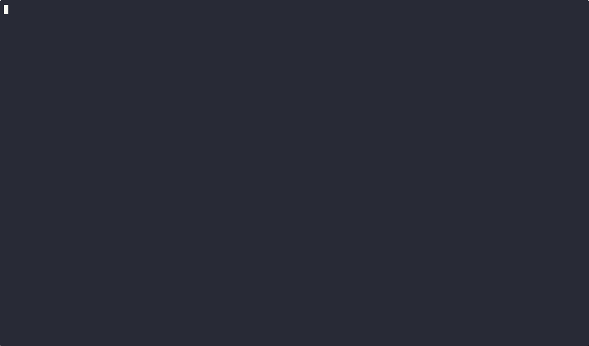

# Applications


_A collection of simple yet powerful microservices designed for cloud-native applications._


## Table of Contents

1. [Introduction](#introduction)
2. [Contents](#contents)
3. [Use Cases](#use-cases)
4. [Launch](#launch-applications)
5. [Contributing](#contributing)
6. [License](#license)

# Introduction

This repository serves as a portfolio of reusable Flask applications, each one designed to be modular, lightweight

and easily integrable with containerized environments like **Docker Compose**, **AWS ECS** and **AWS EKS**.

# Contents

This repository contains the following Flask applications:

1. **Farewell API**
   Returns a random farewell phrase.

2. **Fareweller API**
   Returns a farewell message built based on Farewell and Name APIs.

3. **Greeter API**
   Returns a greeting message built based on Greeting and Name APIs.

4. **Greeting API**
   Provides greeting phrases.

5. **Name API**
   Supplies random names.

6. **SQS Processor**
   Processes SQS messages and displays states within a landing page.

# Use Cases

These applications were created as modular services that can be integrated into larger cloud-native projects.

The primary use cases include:

- **Portfolio Projects**: Demonstrating cloud-native development with Flask, Docker, ECS, EKS, Terraform and Terragrunt.
- **Reusable Modules**: Serving as building blocks for larger microservice architectures.
- **Learning & Experimentation**: Providing a playground for experimenting with cloud technologies, CI/CD pipelines and container orchestration.

# Launch Applications

1. Docker Compose can start all applications locally:



2. Review each `README` file for each application to understand endpoints and ports.

# Build and Push Apps Docker Images

## Through manual script (debugging purposes)

Within `scripts` folder, you can build and push all Docker images manually using the following bash script:

```bash
cd scripts

./build-and-push-images.sh
```

## Through Github Actions (Continuous Integration and Deployment)

This repository includes a GitHub Actions workflow to build and push Docker images for all applications.

The workflow is designed to be efficient by only building and pushing images for directories that have changed in a commit.

### Workflow Details

- **Trigger Conditions:** The workflow triggers on push and pull_request events for any file or directory in the repository.

- **Selective Build and Push:** Only directories containing a Dockerfile and changed in the current commit are built and pushed to Docker Hub.

- **Image Tagging:** The Docker images are tagged using the short commit SHA (HEAD) for traceability.

This approach ensures that Docker images are only built and pushed when necessary, saving time and resources while maintaining traceability through commit SHA tags.

## Clean up local environment

Within `scripts` folder, you can run a script to clean all docker images, containers and volumes:

```bash
cd scripts

./docker-clean-up.sh
```

# Contributing

Contributions are welcome and greatly appreciated! If you would like to contribute to this project, please follow the guidelines within [CONTRIBUTING.md](CONTRIBUTING.md).

# License

This project is licensed under the terms of the [MIT License](LICENSE).
